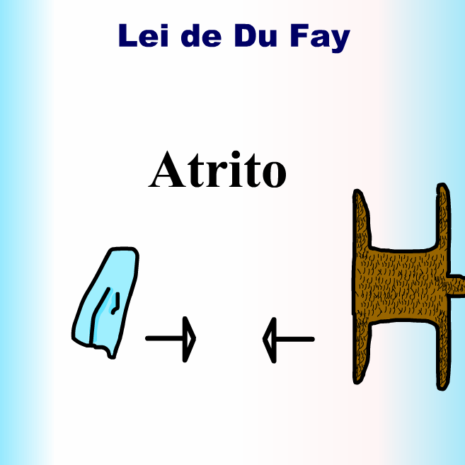
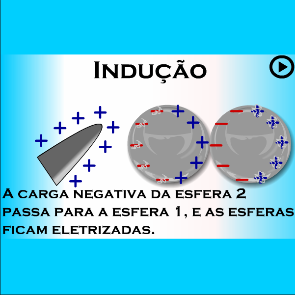
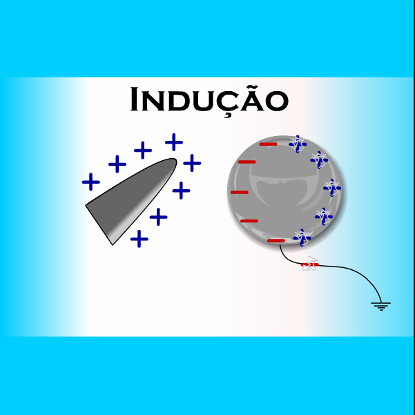
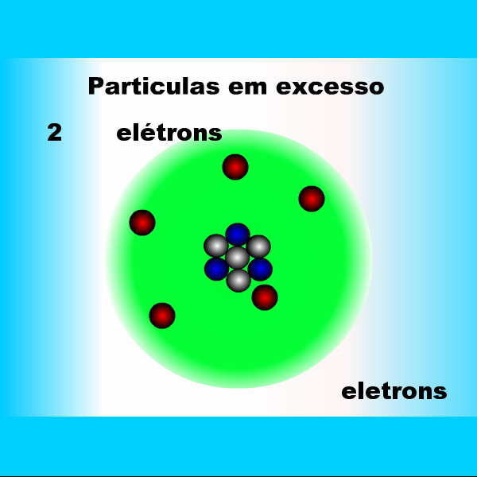
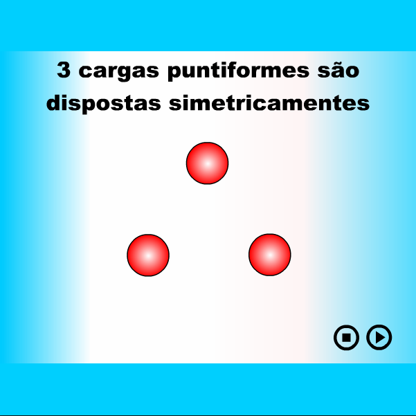
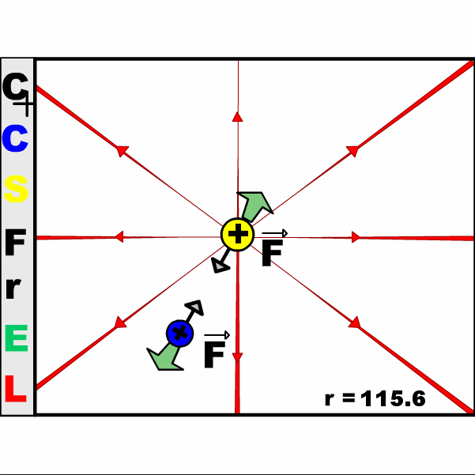
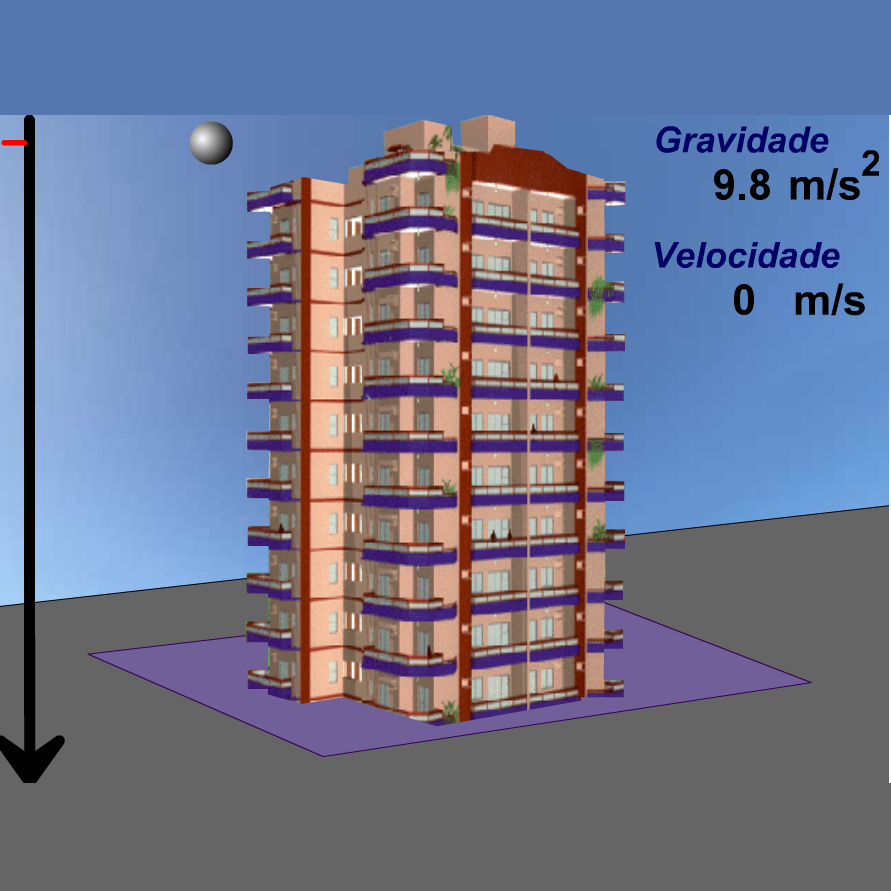
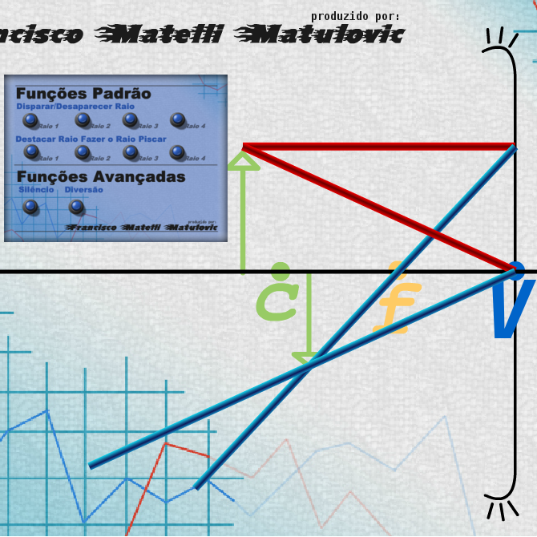

# Ensino de Física Animado
by Francisco Mat
Made in 2004

Animated clips for classes showing physics priciples. Filmes em Flash feitos para colégios. Iniciativa do prof. José Ivo Rocha Campos Filhos

# Du Fay Law
Atrito e lei de Du Fay

# Induction 2 espheres
Indução duas esferas

# Induction Ground Wire
Indução fio-terra

# Atoms Particles
Partículas Atômicas

# Coloumb Law
Lei de Coloumb

# Electric Field
Campo elétrico

# Gravity and Free Fall
Gravidade e queda livre

# Concave Mirror and Reflection
Espelho Côncavo, reflexos e ponto focal

* Made in Windows XP + Flash MX.

Francisco Matelli Matulovic - 2004 - 2018